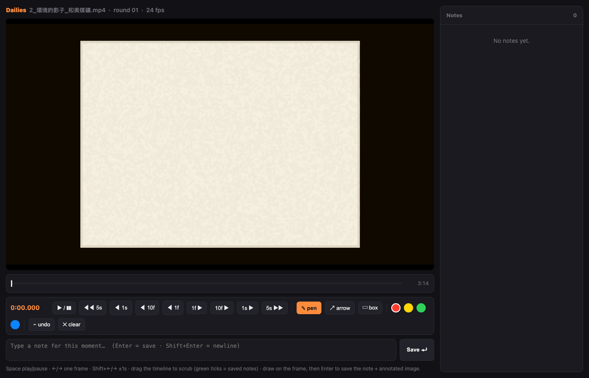

# Dailies

A tiny, dependency-free local server for reviewing a video and leaving
timestamped, drawn-on-the-frame feedback — built as a companion to the
[video-use](https://github.com/browser-use/video-use) Claude Code skill, but
useful standalone for any video review workflow.

Point it at an `.mp4`, it opens a browser page where you can scrub the video,
type a comment at any timestamp, and draw pen/arrow/box annotations directly
on a paused frame. Every note is written straight to disk as it's made — a
JSON file plus one flattened PNG per annotated frame.

Why this exists: describing a video problem in prose ("at 1:32 the caption
is cropped on the right, move it up") is slow and imprecise. Circling it on
the actual frame is instant and unambiguous.



## Usage

```bash
python dailies_server.py path/to/preview.mp4
```

This opens `http://127.0.0.1:8756/` in your browser. Controls:

- `Space` — play/pause
- `←` / `→` — step one frame
- `Shift+←` / `Shift+→` — step one second
- `Enter` — add a timestamped comment
- Pen / arrow / box tools — draw on the paused frame

Options:

```bash
python dailies_server.py preview.mp4 --port 8756       # change the port
python dailies_server.py preview.mp4 --round 3          # force a round number
python dailies_server.py preview.mp4 --edit-dir ./edit  # override output location
python dailies_server.py preview.mp4 --no-open          # don't auto-open a browser tab
```

## Output

By default, output lands next to the video (in an `edit/` directory if the
video is already inside one):

```
edit/review/<video-stem>_r01.json         # notes: timestamp, comment, tool, strokes
edit/review/frames/<video-stem>_r01_01_92.40.png   # annotated frame per note
```

The round number (`r01`, `r02`, …) auto-increments per video each time you
run a fresh review pass, so the file history is the correction log across
rounds. The JSON is rewritten after every single note, so it's safe to
`Ctrl-C` at any point — nothing is lost.

## Requirements

- Python 3.10+, standard library only
- `ffprobe` on `PATH` (used once, to read the video's frame rate)

No pip install, no build step — `dailies_server.py` and `dailies.html` are
the whole tool. Copy both files anywhere and run.

## Integration with video-use

This was built for the [video-use](https://github.com/browser-use/video-use)
video-editing skill's review loop: an LLM agent driving an edit reads the
JSON notes and the annotated PNGs directly (it *sees* the circled problem)
instead of parsing a written description, then applies the fix and re-renders.
It works the same way standalone — point it at any `.mp4` and read the output
JSON/PNGs yourself, or hand them to an agent.
